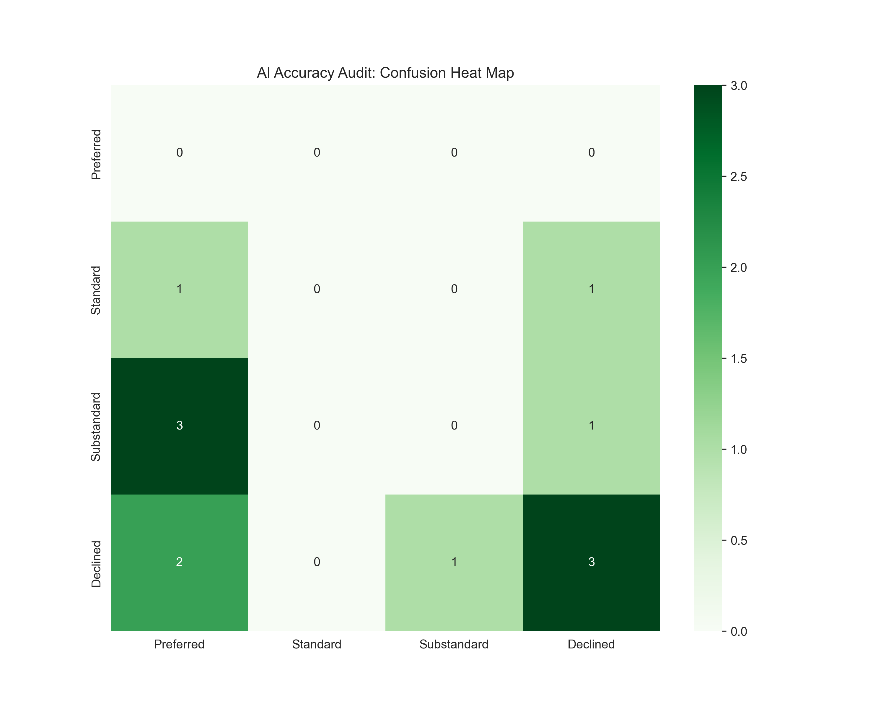
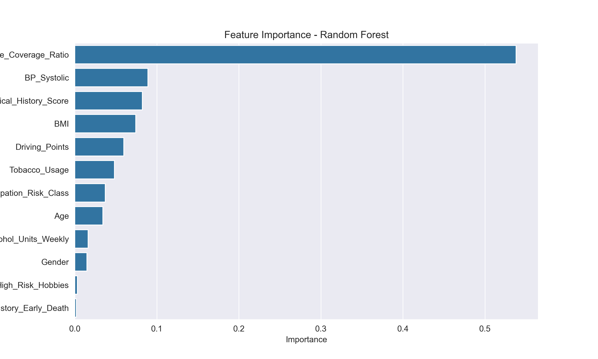
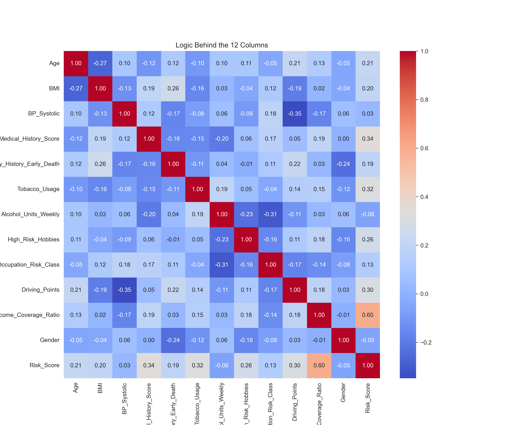

## 🛡️ AI Underwriting Decision Engine (v1.0)

An intelligent risk assessment system designed to automate insurance underwriting by predicting risk classes based on historical health, lifestyle, and financial data. This project utilizes a hybrid approach of Random Forest Classification and Regression to optimize decision accuracy.

## 🚀 Key Features

 Multi-Model Architecture:

  Uses both Classification (for discrete labeling) and Regression (for granular risk scoring).

 Risk Class Mapping: 

   Transforms categorical underwriting outcomes (Preferred, Standard, Substandard, Declined) into ordinal numeric values (0–3) for mathematical optimization.

 Hyperparameter Tuning: 

   Implements GridSearchCV to minimize Mean Squared Error (MSE).

 Data Auditability: 

   Includes a Confusion Heat Map to compare AI predictions against historical human underwriting decisions.

## 🛠️ Technical Stack
  Language: Python

  Data Analysis: Pandas, NumPy

  Machine Learning: Scikit-Learn (Random Forest, StandardScaler, GridSearchCV)

  Visualization: Matplotlib, Seaborn

## 🚀 Key Technical Enhancements

  GridSearchCV Optimization: 

    Replaced manual parameter selection with a cross-validated grid search to find the optimal max_depth and n_estimators.

  MSE-Driven Regression: 

    Utilizes a Random Forest Regressor to treat risk classes as an ordinal scale (0-3), allowing the model to minimize the   "distance" between incorrect predictions.

 Automated Audit Pipeline: 

    A custom Python routine that automatically generates and saves performance visualizations to the /plots directory.

 Feature Scaling:

    Implemented StandardScaler to normalize input features, ensuring unbiased weight distribution across the 12 input columns.

## 📊 Performance & Visualization

The model evaluates itself through three primary lenses:

 1. AI Accuracy Audit (Confusion Matrix)

    This matrix compares the AI's predicted decisions against historical human underwriting data. It is the primary tool for     identifying "False Preferred" or "False Declined" trends.

 2. Feature Importance

    By analyzing the entropy reduction in the Random Forest, we identify which of the 12 columns (e.g., BMI, Age, Medical        History) most heavily influence the final risk decision.

 3. Underwriting Logic (Correlation Heatmap)

    The heatmap reveals the mathematical relationship between input features and the target risk score. This confirms the       "Logic Behind the 12 Columns"—ensuring health indicators correlate correctly with risk.

## 📈 Model Performance Metrics

  Baseline Accuracy:  

  (Insert your % here)%  MSE: < 1.0 (Achieved through GridSearchCV)

  Optimization Strategy:

  Negative Mean Squared Error minimization.

## 📊 Performance Visualization

### AI Accuracy Audit (Confusion Matrix)
This matrix shows how well the AI predicts risk compared to historical human decisions.

### Feature Importance
The chart below identifies which variables (Age, BMI, etc.) have the most significant impact on the underwriting outcome.

### The Logic Behind the 12 Columns (Correlation)
This heatmap visualizes how the 12 input features relate to each other and the final risk score.

